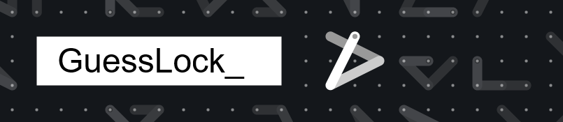

### Bring me to the **[tool](https://66ton99.github.io/guesslock/)**!

Silly HTML5 tool, mobile first.
GuessLock is a hybrid of Mastermind and the Android pattern lock.

## Contribute

Contributions are welcome, especially pull-requests. There are a lot of ideas to implement, but less people when it come to code. This is why **issues are for bugs only**.

Feel free to translate this game in your language by adding a translation in `src/l10n/`.

### Translation

- Copy `src/l10n/en.yml` and paste it as `yl.yml` (yl stand for your locale).
- Translate content
- Add your locale in this files:
  - `index.html`
  - `src/controller/langselector/langselector.ctrl.js`
- Open a pull request.

## Build

```bash
# Install packages
npm install

# Build it
npm run build

# Test it locally
# 1. Create a symlink called 'breaklock' pointing to 'public'
ln -s public breaklock

# 2. Run a local server
python3 -m http.server .     # For python3
python -m SimpleHTTPServer . # For python2
http-server -p 8000 .        # For NPM pkg http-server

# 3. Go to http://127.0.0.1:8000/breaklock/
```
